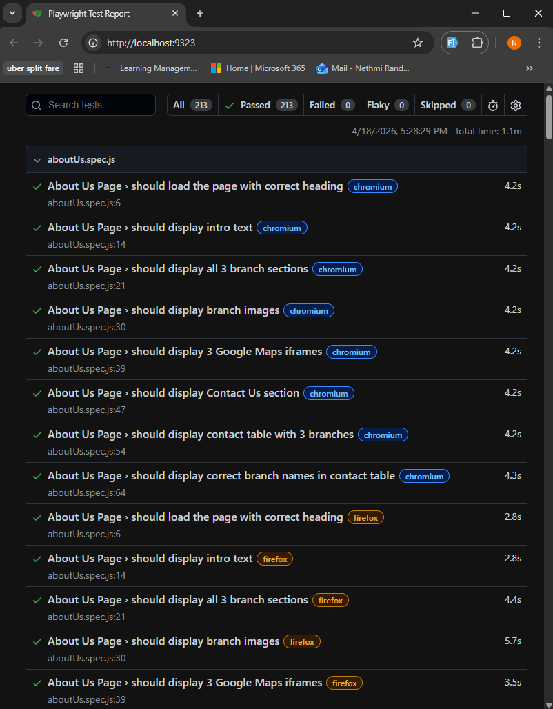

# Wellspring Hospital - Playwright Automation Testing                                                                                                                         
                                                                                                                                                                                
  Automated end-to-end testing for the [Wellspring Hospital Website](https://nethmipalliyaguruge.github.io/Hospital-Project-CB015790/) using Playwright with JavaScript.        
                                                                                                                                                                                
  ## About the Project

  This project contains automated test cases for a hospital management website built with HTML, CSS, and JavaScript. The tests follow the **Page Object Model (POM)** design
  pattern for better maintainability and reusability.

  ### Website Under Test

  The Wellspring Hospital website includes:
  - Home page with hospital information
  - Patient Registration form
  - Consulting Reservation system
  - Online Pharmacy with cart functionality
  - Billing and Payment page
  - Doctors directory
  - Services listing
  - About Us with branch locations and contact details

  ## Tech Stack

  - **Testing Framework:** Playwright
  - **Language:** JavaScript
  - **Design Pattern:** Page Object Model (POM)
  - **Browsers Tested:** Chromium, Firefox, WebKit (Safari)

  ## Test Coverage

  | Test File | Page Tested | Test Cases |
  |-----------|------------|------------|
  | `homepage.spec.js` | Home Page | 10 |
  | `navigation.spec.js` | Navigation Links | 7 |
  | `patientRegistration.spec.js` | Patient Registration Form | 8 |
  | `consultingReservation.spec.js` | Consulting Reservation Form | 7 |
  | `pharmacy.spec.js` | Pharmacy & Cart | 10 |
  | `billing.spec.js` | Billing & Payment | 7 |
  | `doctors.spec.js` | Doctors Directory | 7 |
  | `services.spec.js` | Services Page | 7 |
  | `aboutUs.spec.js` | About Us Page | 8 |
  | **Total** | **8 Pages** | **71 Test Cases** |

  > 71 test cases × 3 browsers = **213 tests executed**

  ## Types of Tests

  - **Page Load Tests** — Verify pages load with correct titles and headings
  - **Content Visibility Tests** — Check that key elements (logos, images, text) are displayed
  - **Navigation Tests** — Verify all navigation links route to correct pages
  - **Form Tests** — Fill forms, validate required fields, test reset functionality
  - **Dropdown Tests** — Verify doctor selection options in consulting reservation
  - **Dynamic Content Tests** — Test pharmacy medicine loading from JSON
  - **Cart Functionality Tests** — Add items, verify totals, reset cart
  - **Cross-Browser Tests** — All tests run on Chrome, Firefox, and Safari

  ## Project Structure

  ```
  Playwright_Hospital_Project/
  ├── tests/
  │   ├── pages/                          # Page Object Model classes
  │   │   ├── HomePage.js
  │   │   ├── PatientRegistrationPage.js
  │   │   ├── ConsultingReservationPage.js
  │   │   ├── PharmacyPage.js
  │   │   ├── BillingPage.js
  │   │   ├── DoctorsPage.js
  │   │   ├── ServicesPage.js
  │   │   └── AboutUsPage.js
  │   ├── homepage.spec.js                # Home page tests
  │   ├── navigation.spec.js              # Navigation tests
  │   ├── patientRegistration.spec.js     # Patient registration form tests
  │   ├── consultingReservation.spec.js   # Consulting reservation tests
  │   ├── pharmacy.spec.js                # Pharmacy and cart tests
  │   ├── billing.spec.js                 # Billing page tests
  │   ├── doctors.spec.js                 # Doctors page tests
  │   ├── services.spec.js                # Services page tests
  │   └── aboutUs.spec.js                 # About Us page tests
  ├── screenshots/                        # Test run screenshots
  │   └── test-report.png
  ├── playwright.config.js                # Playwright configuration
  ├── package.json
  └── README.md
  ```

  ## How to Run

  ### Prerequisites

  - Node.js (v18 or higher)

  ### Installation

  ```bash
  # Clone the repository
  git clone https://github.com/NethmiPalliyaguruge/Hospital-Playwright-Tests.git

  # Navigate to project folder
  cd Hospital-Playwright-Tests

  # Install dependencies
  npm install

  # Install Playwright browsers
  npx playwright install
  ```

  ### Running Tests

  ```bash
  # Run all tests across all browsers
  npx playwright test

  # Run tests on a specific browser
  npx playwright test --project=chromium
  npx playwright test --project=firefox
  npx playwright test --project=webkit

  # Run a specific test file
  npx playwright test tests/homepage.spec.js

  # Run tests with visible browser (headed mode)
  npx playwright test --headed

  # Generate and view HTML report
  npx playwright show-report
  ```

  ## Test Report

  All Tests Passing (213/213)

  

  ## Key Learnings

  - Implemented Page Object Model for scalable and maintainable test architecture
  - Handled cross-browser compatibility issues (Firefox radio button rendering)
  - Used role-based locators (getByRole, getByText, getByLabel) for accessible element selection
  - Tested dynamic content loaded asynchronously from JSON
  - Handled JavaScript dialogs (alerts) during cart operations